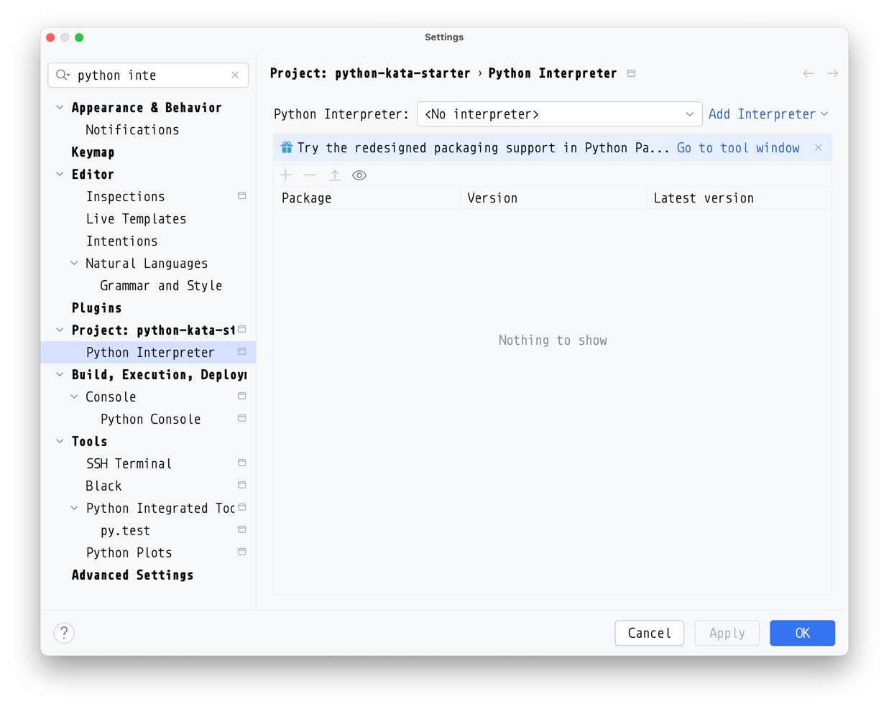

# Setup the development environment

We don't want that libraries used for this project will pollute the global 
Python installation.

Usually this is solved creating a so-called "virtual environment" which act as
a local installation of Python.

The simplest way to create a new virtual environment (in Python 3.x) is 
launching the following command: 

```bash
$ python -v venv .venv 
```

After that command a .venv directory will be created. 

Other alternatives are virtualenv which works with Python 2.x, and poetry that
does also some other things.

The .venv directory should be not tracked by the version control system because
their content may work only on the current machine.

```bash
$ cat .gitignore
/.venv/
```

The environment can be used only if it is activated.
```bash
$ source .venv/bin/activate
(.venv) $
```

After sourcing this script the shell will load some environment variables that
permit to use the Python executable in this environment. For the PATH variable
is updated in order to find the python executable in the .venv/bin directory.

# libraries

With the virtual environment activated we can install some libraries in it, 
just using the `pip` command.

For example if we want need a yaml library we can install

```bash
(.venv) $ pip install PyYAML
```

Unfortunately this is operation will be not saved automatically in any 
configuration file tracked by the version control.

But pip provides a method for listing all the libraries currently installed 
comprising the exact version used. The output of this command if saved  can be 
used to reproduce a similar environment in another machine.

To see the output of the command we need just to call it:

```bash
(.venv) $ pip freeze
PyYAML==6.0.1
```

It's common to save the output of the command in a file called requirements.txt
in order to be used later for reinstalling all the dependencies.

```bash
(.venv) $ pip freeze > requirements.txt
```

Usually this file is tracked using version control.
```bash
(.venv) $ git add requirements.txt
(.venv) $ git commit -m "Adding requirements.txt"
```

The requirements.txt file can be later used to restore all the libraries using 
the `-r` option

```bash
(.venv) $ pip install -r requirements.txt
Collecting PyYAML==6.0.1 (from -r requirements.txt (line 1))
  Using cached PyYAML-6.0.1-cp311-cp311-macosx_11_0_arm64.whl.metadata (2.1 kB)
Using cached PyYAML-6.0.1-cp311-cp311-macosx_11_0_arm64.whl (167 kB)
Installing collected packages: PyYAML
Successfully installed PyYAML-6.0.1
```

Is not mandatory to insert the library version, it can be omitted, for kata I 
prefer use the last images of the libraries.

```bash
(.venv) $ pip uninstall PyYAML
(.venv) $ vim requirements.txt
(.venv) $ cat requirements.txt
PyYAML
(.venv) $ pip install -r requirements.txt
Collecting PyYAML (from -r requirements.txt (line 1))
  Using cached PyYAML-6.0.1-cp311-cp311-macosx_11_0_arm64.whl.metadata (2.1 kB)
Using cached PyYAML-6.0.1-cp311-cp311-macosx_11_0_arm64.whl (167 kB)
Installing collected packages: PyYAML
Successfully installed PyYAML-6.0.1
```

# Exiting virtual environment and cleaning up
In order to exit the virtual environment we need to call the `deactivate` 
command.

```bash
(.venv) $ deactivate
$ 
```

As you can see the prompt will lose the "(.venv) " prefix.

The environment can be completely deleted if you want.
```bash
$ rm -Rfv .venv
```

# Libraries needed for testing

## Standard libraries

Python itself already include a testing library called `unittest`. It's a solid
and portable solution, and you don't necessarily need other libraries. It 
already includes a mock library called `unittest.mock`.

The official documentation is:
 - https://docs.python.org/3/library/unittest.html
 - https://docs.python.org/3/library/unittest.mock.html

## Another useful library for testing: pytest

PyTest is a third party library with a lighter-weight syntax for writing tests 
(as cited in the unittest documentation) which provides some useful test tagging
mechanism that can be used to set apart integration tests. I use it in the 
trash-cli project.

I think is a good choice for professional project if you don't have limitation 
on which library you can add to the project.

When I start a kata I just add the pytest library in the requirements.txt file:
```bash
(.venv) $ echo pytest >> requirements.txt
(.venv) $ cat requirements.txt
PyYAML
pytest
(.venv) $ pip install -r requirements.txt
```

Some IDE like PyCharm recognized the requirements.txt file and will install
automatically the libraries listed in there.

There is a little problem with JetBrains IDE (like PyCharm), they don't always
understand that always want to use the virtual environment under the .venv 
subdirectory of the project. 

This can be solved from the Python Interpreter in Preferences.



* You need to click Add Interpreter > Add Local Interpreter...
* Then: Virtualenv environment > Existing
* At this point you should choose the path that points to:
  - `<YOUR PROJECT DIR>/.venv/bin/python` 


